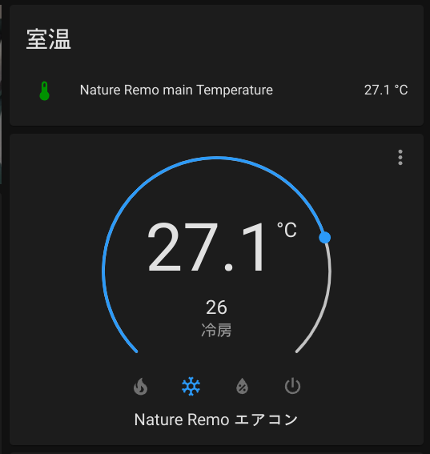

# hacs-nature-remo

[](https://github.com/kkiyama117/hacs-nature-remo)

This is the integration for sending commands and fetching data easily from[nature remo](https://en.nature.global/)
⚠️This integration is neither Nature Remo official nor Home Assistant official. **Use at your own risk.** ⚠️

This is heavily inspired by https://github.com/yutoyazaki/hass-nature-remo and its forks, but using [package](https://github.com/morinokami/nature-remo) for the part of the data exchange with API, and implemented in the way recommended by the official API for ease of maintenance.



## Supported features

- [x] Air Conditionar
  - [x] Set mode (e.g. cool, warm, blow etc.)
  - [x] Set temperature
  - [x] Set fan mode
  - [x] Set swing mode
  - [x] Show current temperature
  - [x] Remember previous target temperatures when switching modes back and forth

## Implemented but not tested
The features listed below are adapted from other nature remo plugins and refactored to use [package from pip](https://github.com/morinokami/nature-remo),but I don't have anything to test them.
please test them if you have an environment to try in the following.

- [x] Energy Sensor (Nature Remo E/E Lite)
  - [x] Fetch current power usage
- [x] Switch
- [x] Light
- [ ] TV
- [x] Others
  - [x] Fetch sensor data
  
## Installation

### Manual Install

1. Download this repository
1. Create `custom_components/hacs_nature_remo` folder at your config directory
1. Copy all files of this repository into it (Just drag&drop whole files would be fine)

```
{path_to_your_config}
├── configuration.yaml
└── custom_components
    └── hacs_nature_remo
        ├── __init__.py
        ├── climate.py
        ├── manifest.json
        ├── sensor.py
        └── ... 
```


## Configuration

Now We need to edit configuration.yaml directly because configuration screen haven't implemented yet. 

1. Go to https://home.nature.global and sign in/up
1. Generate access token
1. Add following codes to your `configuration.yaml` file

```yaml
hacs_nature_remo:
  access_token: YOUR_ACCESS_TOKEN
```

[Using `secret.yaml` is recommended by the official](https://www.home-assistant.io/docs/configuration/secrets/)
